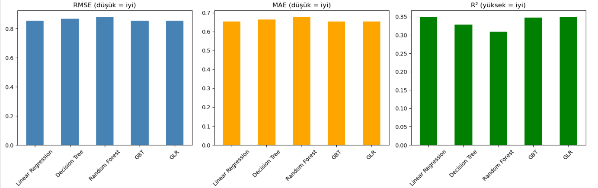
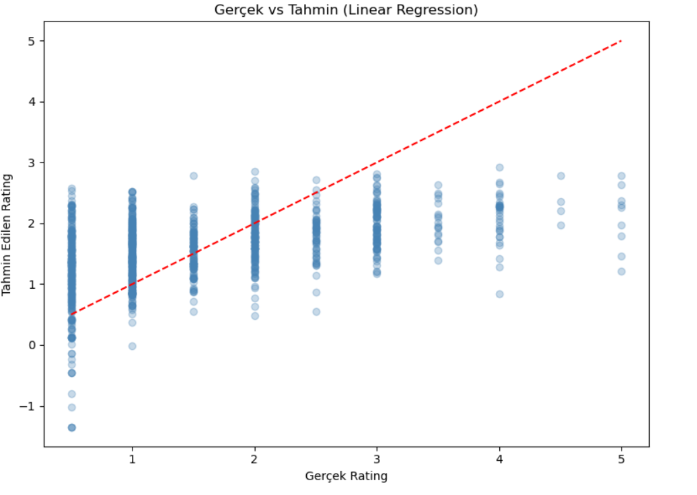
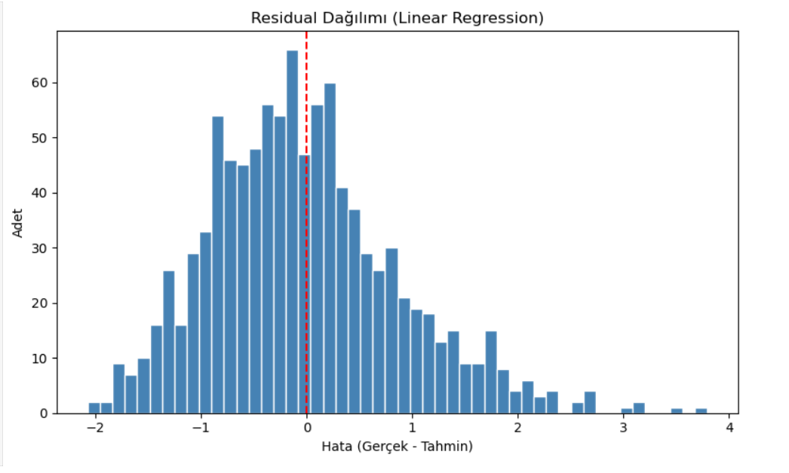
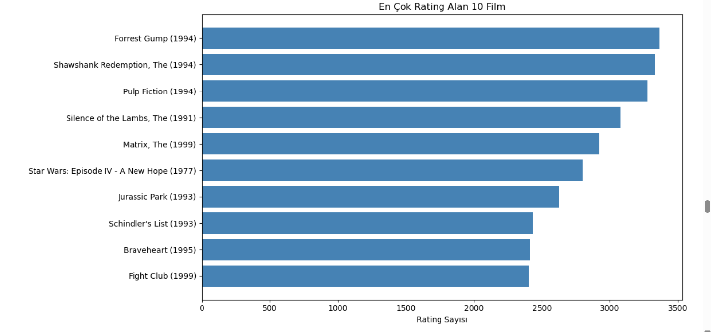
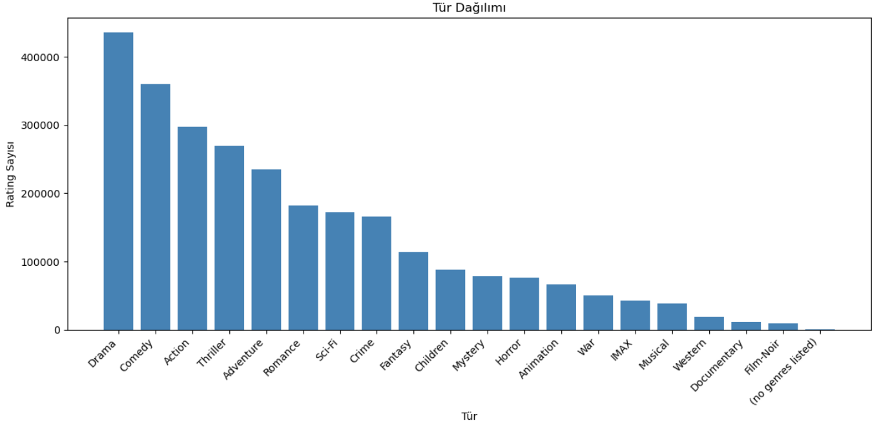
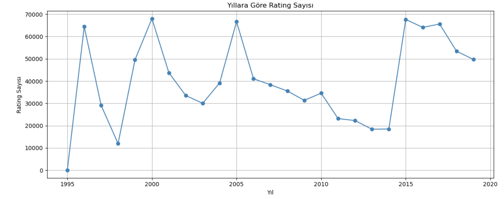
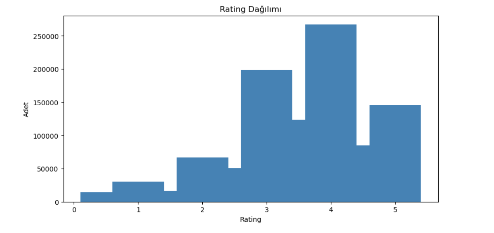

# MovieLens 25M - Büyük Veri Pipeline Projesi

## Proje Hakkında
MovieLens 25M veri seti kullanılarak uçtan uca büyük veri pipeline'i.
Rating tahmini için regresyon modelleri kullanılmıştır.

## Kullanılan Teknolojiler
- Docker + Docker Compose
- Apache Kafka (Streaming)
- Apache Spark + PySpark
- Delta Lake (Bronze/Silver/Gold)
- MLflow (Model takibi)

## Kurulum

### 1. Gereksinimleri Kur
- Docker Desktop
- Python 3.10+

### 2. Servisleri Başlat
```bash
docker compose up -d
```

### 3. Jupyter'e Bağlan
Tarayıcıda aç: http://localhost:8888

### 4. Producer'ı Çalıştır
```bash
cd producer
pip install -r requirements.txt
python producer.py
```

## Proje Yapısı

movielens-bigdata-pipeline/
├── docker-compose.yml
├── producer/
│   ├── producer.py
│   ├── Dockerfile
│   └── requirements.txt
├── notebooks/
│   ├── 03_spark_okuma.ipynb
│   └── 06_modeller.ipynb
└── screenshots/

## Veri Seti
MovieLens 25M - https://grouplens.org/datasets/movielens/25m/
- 25 milyon rating
- 62,000 film
- 162,000 kullanıcı

## Model Sonuçları
| Model | RMSE | MAE | R² |
|-------|------|-----|-----|
| Linear Regression | 0.8538 | 0.6538 | 0.3492 |
| Decision Tree | 0.8676 | 0.6651 | 0.3279 |
| Random Forest | 0.8797 | 0.6774 | 0.3090 |
| GBT | 0.8549 | 0.6543 | 0.3475 |
| GLR | 0.8538 | 0.6538 | 0.3492 |

## Görseller

### Rating Dağılımı


### En Çok Rating Alan 10 Film


### Tür Dağılımı


### Yıllara Göre Trend


### Model Karşılaştırma


### Gerçek vs Tahmin


### Residual Dağılımı
